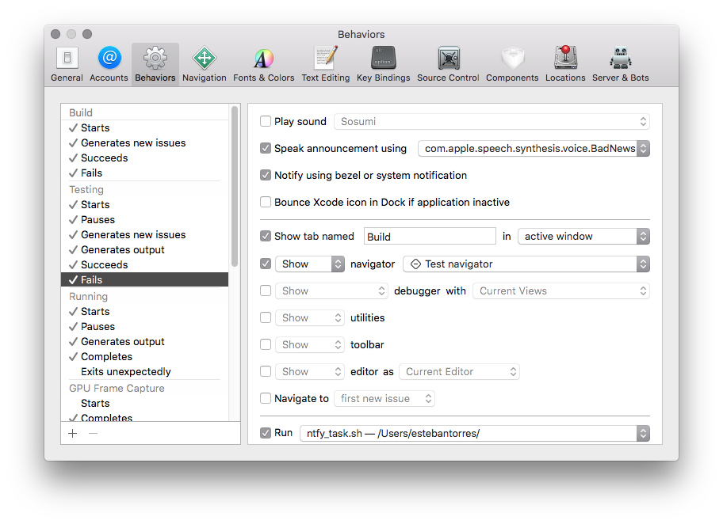

Since quite some time now I've been working on `Xcode` projects that are pretty big; big enough to take up a considerable amount of time to finish compiling, even worst if you are running the tests and it needs to build EVERYTHING and then run ALL the tests.

I also like to multi-task and do some other stuff while I'm compiling…
<!-- [](https://xkcd.com/303/) -->


<!--more-->

For the longest time I thought about creating some sort of service that would let me hook up some push notifications whenever `Xcode` finished doing *X* or *Y* task but never came around actually creating it. Time passed and I basically forgot all about this dream of mine.

That is until today when I found out about [`ntfy`][ntfy]…

# ntfy

>`ntfy` brings notification to your shell. It can automatically provide desktop notifications when long running commands finish or it can send push notifications to your phone when a specific command finishes.

**TL,DR**: `ntfy` is a `python` 🐍  tool that sends notifications to different configurable backend services.

**TL;DR 2**: `ntfy` is basically the service I wanted to build and never came around to actually making.

## Installation

The tool's `README` is pretty nicely done and comes with a `Quickstart` section that describes how to install it; unfortunately for me it didn't work due to some obscure error:

```console
Command "python setup.py egg_info" failed with error code 1
```

Which was easily sortable by running `pip3` instead of `pip` when installing; effectively making it:

```console
sudo pip3 install ntfy
```

# Hooking it into `Xcode`

Now that the tool was installed on my machine it was just a matter of hooking it into `Xcode` behaviors (_Xcode -> Preferences -> Behaviors_)



At the very bottom of the window there's a `Run` checkbox where you can choose a script/binary that you want to run whenever a behavior happens.

At first I had 1 script per behavior but then I discovered that there's an env variable that gets passed that has all the information I needed.

## Available variables

There are many variables that get passed to the binary/script; here's a redacted list of them from my own tests:

```
Apple_PubSub_Socket_Render=<REDACTED>
CA_DEBUG_TRANSACTIONS=1
HOME=<REDACTED>
IDEAlertMessage=Build Succeeded
LOGNAME=<REDACTED>
MallocNanoZone=0
PATH=/Applications/Xcode-9.2.app/Contents/Developer/usr/bin:/usr/bin:/bin:/usr/sbin:/sbin
PWD=<REDACTED>
SECURITYSESSIONID=<REDACTED>
SHELL=/usr/local/bin/zsh
SHLVL=1
SSH_AUTH_SOCK=<REDACTED>
TMPDIR=/var/folders/g1/<REDACTED>/T/
USER=estebantorres
XPC_FLAGS=0x0
XPC_SERVICE_NAME=0
XcodeDeveloperApplicationsDirectory=/Applications/Xcode-9.2.app/Contents/Developer/Applications
XcodeDeveloperDirectory=/Applications/Xcode-9.2.app/Contents/Developer
XcodeDeveloperPlatformsDirectory=/Applications/Xcode-9.2.app/Contents/Developer/Platforms
XcodeWorkspace=<REDACTED>.xcworkspace
XcodeWorkspacePath=/Users/estebantorres/<REDACTED>.xcworkspace
_=/usr/bin/env
__CF_USER_TEXT_ENCODING=0x1F6:0x0:0x0
```

Whenever a behavior gets executed (depending on which one) the script or binary you want to execute gets feed a set of environment variables; one of them being `IDEAlertMessage` which basically contains the message that `Xcode` displays (I also believe is the message that gets passed to the notification that `macOS` renders whenever `Xcode` starts, ends, fails to build or run tests; etc.)

As you can see the see `IDEAlertMessage` has everything I needed; is just a matter of calling `ntfy` with the contents of that variable and the `Xcode Workspace` and then you are set.

## Script

If you don't want to play around this is the contents of my script:

`ntfy.sh`
```bash
#! /bin/sh

/usr/local/bin/ntfy -b telegram send "$XcodeWorkspace $IDEAlertMessage"
```

_You might have noticed the `-b telegram` part. This you can check how to configure on [`ntfy`][ntfy]'s `README`; if you don't want to use `Telegram` you can tweak it to use any of the other supported services._

# Result


There are lots of room for improvement here, but this basically satisfy my needs; I can start building and or running my tests; leave to the cafeteria to grab a coffee and know wether or not the build passed or not without having to wait.

## Why this?

You might not find this all that useful; and perhaps I won't either, but only time will tell.
For now I'm quite happy with the results and pretend to take as much advantage as I can.


[ntfy]:https://github.com/dschep/ntfy