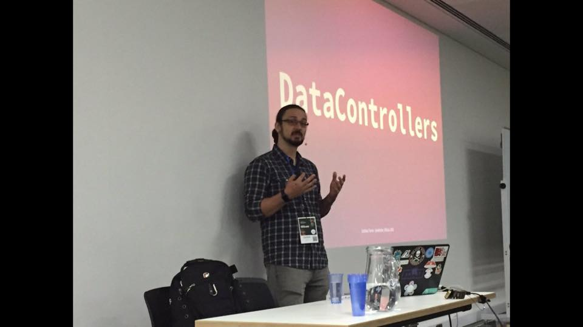

title: Talks
date: 2016-07-15 09:10:02
---

I first began getting involved in talks around 2012 when I started organizing «Tech Talks» where I used to work at the time.

Since then I have given many talks at the local CocoaHeads and like to try sending proposals to many conference around the globe.

## Upcoming Talks

- _N/A_

## Past Talks

| Date         |                                    Topic |          Conference          |                   Link                   |
| :----------- | ---------------------------------------: | :--------------------------: | :--------------------------------------: |
| 2017-02-16   | **`MVVM(DC)`: Taming your architecture** |        [MobOS][mobos]        |          [Slides][mobosslides]           |
| _2016-10-16_ |               **Hacking _(?)_ `SiriKi`** | [Mobilization][mobilization] |           [Slides][mobslides]            |
| _2016-09-16_ | **`MVVM` + `RxSwift`+ DataControllers** |      [NSSpain][nsspain]      |         [Slides][nsspainslides]          |
| _2016-06-28_ | **`Xcode`'s 8 Source Editor Extensions** |  CocoaHeads Costa Rica   |        [Slides][xcodeextensions]         |
| _2016-05-26_ | **`MVVM` + `RxSwift` + DataControllers** |       [iOScon][ioscon]       | [Video][iosconvideo] • [Slides][iosconslides] |
| _2015-04-21_ |  **Continuos Delivery for iOS Apps** |  CocoaHeads Costa Rica   |            [Slides][fastlane]            |
| _2015-06-12_ |     **Using `Jekyll` & `Octopress`** |      Log(n) Tech Talks       |             [Slides][jekyll]             |

[mobosslides]:https://speakerdeck.com/esttorhe/mvvm-dc-taming-your-architecture
[mobos]:http://romobos.com/agenda-2
[mobilization]:http://2016.mobilization.pl
[mobslides]:https://speakerdeck.com/esttorhe/hacking-siriki-mobilization-2016
[nsspain]:http://2016.nsspain.com
[nsspainslides]:https://speakerdeck.com/esttorhe/mvvm-plus-rxswift-plus-datacontrollers-1

[ioscon]:https://skillsmatter.com/conferences/7598-ioscon-2016-the-conference-for-ios-and-swift-developers

[iosconvideo]:https://skillsmatter.com/skillscasts/7863-mvvm-rxswift-and-datacontrollers
[iosconslides]:https://speakerdeck.com/esttorhe/mvvm-plus-rxswift-plus-datacontrollers
[fastlane]:https://speakerdeck.com/esttorhe/continuos-delivery-for-ios-apps
[jekyll]:https://speakerdeck.com/esttorhe/using-jekyll-and-octopress
[xcodeextensions]:https://speakerdeck.com/esttorhe/xcodes-8-source-editor-extensions#
